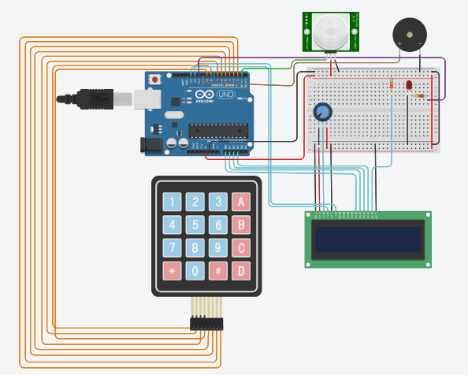

# :cop: Simple Security and Alarm System 

 

## :pushpin: Description

A simple security system that, when a presence is detected, activates an LED and a buzzer until the password is entered.

 

## :robot: Eletronic device

### Required materials

| Quantity | Name | Reference link |
| --- | --- | --- |
| 1 | Keypad 4x4| https://www.baudaeletronica.com.br/produto/teclado-matricial-de-membrana-16-teclas.html |
| 1 | PIR Presence and Motion Sensor | https://www.baudaeletronica.com.br/produto/sensor-de-presenca-e-movimento-pir.html |
| 1 | LCD Display 16X2 | https://www.baudaeletronica.com.br/produto/display-lcd-16x2-azul.html |
| 1 | Buzzer | https://www.baudaeletronica.com.br/produto/buzzer-5v.html |
| 1 | Potentiometer | https://www.baudaeletronica.com.br/produto/potenciometro-linear-de-10k-10000.html |
| 1 | Red LED | https://www.baudaeletronica.com.br/produto/led-difuso-5mm-vermelho |
| 2 | 1KΩ Resistor | https://www.baudaeletronica.com.br/produto/resistor-1k-5-14w.html |

### Circuit

   

 

 

 

## :computer:  Code

You can find it [here](./security.ino)

 

## [:clapper:  Watch it](https://www.youtube.com/watch?v=HtH-oBYSZ9g)

